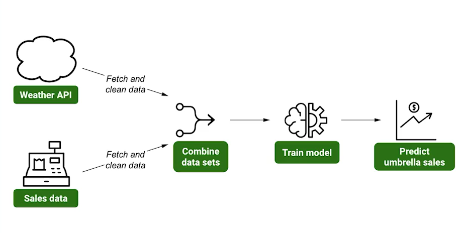
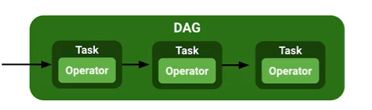
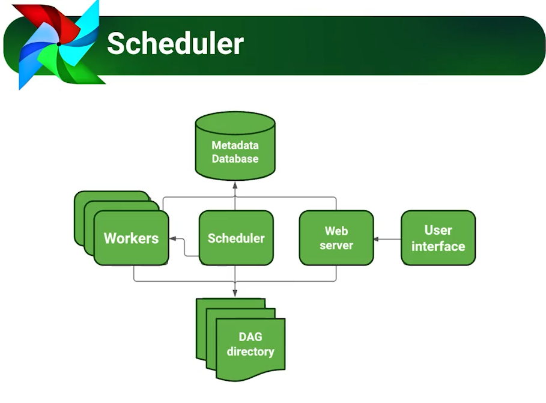

# Airflow
[course](https://platzi.com/cursos/fundamentos-airflow/)
  
  

# Apache airflow
Apache Airflow is an open-source platform used to programmatically author, schedule, and monitor workflows. It is designed to help developers and data engineers build and manage data pipelines. Airflow is written in Python and uses a directed acyclic graph (DAG) to define workflows. It is used to automate and manage complex data pipelines, including ETL (extract, transform, and load) processes, machine learning workflows, and more. Airflow also provides a web interface for monitoring and managing workflows.

# Apache airflow advantages
1. Easy to use: Apache Airflow is designed to be easy to use and maintain. It has a simple UI and a straightforward workflow.

2. Flexible: Apache Airflow is highly flexible and can be used to automate a wide variety of tasks. It can be used to automate data engineering, data science, and machine learning pipelines.

3. Scalable: Apache Airflow is highly scalable and can be used to manage large-scale data processing pipelines.

4. Open source: Apache Airflow is open source and free to use. This makes it an attractive option for organizations that want to save money on their data processing pipelines.

5. Extensible: Apache Airflow is extensible and can be extended with custom plugins and operators. This makes it easy to customize the platform to meet specific needs.

6. Secure: Apache Airflow is secure and can be used to manage sensitive data. It also supports authentication and authorization.

# why i need apache airflow?
Apache Airflow is a powerful open-source platform used to programmatically author, schedule, and monitor workflows. It is used to create complex workflows as directed acyclic graphs (DAGs) of tasks. Airflow is used by organizations to manage and maintain data pipelines, automate machine learning workflows, and monitor ETL processes. Airflow is also used to orchestrate and manage complex data engineering tasks, such as data ingestion, data transformation, and data analysis. Airflow can be used to automate the entire data engineering process, from data ingestion to data analysis. Airflow is also used to monitor and alert on the status of data pipelines and ETL processes.

# apache airflow task and operator
Airflow tasks are the individual units of work that are performed as part of an Airflow workflow. An Airflow task is a directed acyclic graph (DAG) of tasks that are linked together to form a workflow.

Airflow operators are the building blocks of an Airflow workflow. An Airflow operator is a Python class that acts as a template for a task, which contains all the information needed to run that task. Operators are used to perform tasks such as executing a Python function, running a bash command, or transferring data from one system to another.

# Apache airflow scheduler
  
Apache Airflow is an open-source platform to programmatically author, schedule, and monitor workflows. It is a platform to programmatically author, schedule, and monitor workflows and data pipelines. Airflow is used to orchestrate an arbitrary number of tasks and create complex workflows. It is designed to be dynamic, extensible, and reliable. Airflow Scheduler is the component of Airflow that is responsible for scheduling tasks and triggering them at the right time. It is responsible for monitoring all tasks and determining when and where they should be run. The Scheduler is also responsible for retrying failed tasks and alerting users of any issues.


# apache airflow components
1. Webserver: The Airflow webserver is the user interface to the Airflow system. It allows users to manage and monitor their workflows, view logs, and track the progress of their jobs.

2. Scheduler: The Airflow scheduler is responsible for scheduling jobs and managing the workflow. It is responsible for triggering tasks based on the defined schedule and dependencies.

3. Executor: The Airflow executor is responsible for executing tasks. It is responsible for running the tasks in the workflow and managing the resources required for the tasks.

4. DAGs: DAGs (Directed Acyclic Graphs) are the core of Airflow. They define the workflow and the tasks that need to be executed.

5. Operators: Operators are the building blocks of Airflow. They are responsible for performing specific tasks in the workflow.

6. Hooks: Hooks are used to connect Airflow to external systems. They are responsible for connecting to external databases, APIs, and other services.

7. XComs: XComs (Cross-Communication) are used to share data between tasks. They are used to pass data between tasks in a workflow.

commands to install apache airflow
```shell
curl -LfO 'https://airflow.apache.org/docs/apache-airflow/2.5.0/docker-compose.yaml'
mkdir -p ./dags ./logs ./plugins
echo -e "AIRFLOW_UID=$(id -u)" > .env
AIRFLOW_UID=50000
docker compose up airflow-init
docker-compose up
chrome http://localhost:8080
```


# apache airflow dag different implementations
1. standard
2. with
3. decorator


# apache airflow dependencies

Airflow requires the following dependencies:

1. Python (version 2.7 or 3.5+)
2. Airflow (version 1.10.2 or higher)
3. PostgreSQL (version 9.6 or higher)
4. RabbitMQ (version 3.7.7 or higher)
5. Celery (version 4.2.1 or higher)
6. SQLAlchemy (version 1.2.7 or higher)
7. Jinja2 (version 2.10 or higher)
8. Paramiko (version 2.4.2 or higher)
9. SSH (version 2.0 or higher)
10. Apache Airflow Plugins (version 1.10.2 or higher)

# apache airflow custom operator
An Airflow custom operator is a Python class that inherits from the BaseOperator class and is located in the airflow/operators/ directory. It allows users to extend the existing Airflow operators and define their own custom operators to perform specific tasks. Custom operators can be used to perform complex tasks such as data transformation, data loading, data validation, and more. They can also be used to integrate with external systems such as databases, APIs, and other services.

# airflow dummy dag
```python
from airflow import DAG
from datetime import datetime
from airflow.operators.empty import EmptyOperator

with DAG(
    dag_id="primer_dag",
    description="primer dag",
    start_date=datetime(2023, 1, 2),
    schedule_interval="@once"
) as dag:
    t1 = EmptyOperator(task_id="dummy")
    t1
```

# airflow dag bash operator
```python
from airflow import DAG
from airflow.operators.bash import BashOperator
from datetime import datetime

with DAG(
    dag_id="primer_bashoperator",
    description="primer bash operator",
    start_date=datetime(2023, 1, 2),
    schedule_interval="@once"
) as dag:
    t1 = BashOperator(
        task_id="hello_with_bash",
        bash_command="echo 'hi there'"
    )
    t1
```

# airflow python operator
```python
from airflow import DAG
from airflow.operators.python import PythonOperator
from datetime import datetime

def print_hello():
    print("hola gente de platzi")

with DAG(
    dag_id="primer_pythonoperator",
    description="primer python operator",
    start_date=datetime.now(),
    schedule_interval="@once"
) as dag:
    t1 = PythonOperator(
        task_id="hello_with_python",
        python_callable=print_hello
    )
    t1
```

#  airflow dependencies
```python
from airflow import DAG
from airflow.operators.bash import BashOperator
from airflow.operators.python import PythonOperator
from airflow.operators.empty import EmptyOperator
from datetime import datetime

def print_hello():
    print("hola gente de platzi")

with DAG(
    dag_id="primer_dependencies",
    description="primer dependencies operator",
    start_date=datetime.now(),
    schedule_interval="@once"
) as dag:
    t1 = EmptyOperator(task_id="t1_dummy")
    t2 = BashOperator(
        task_id="t2_hello_with_bash",
        bash_command="echo 'hi there'"
    )
    t3 = PythonOperator(
        task_id="t1_hello_with_python",
        python_callable=print_hello
    )
    t1 >> t2 >> t3
```

# airflow housing ml
[youtube video](https://www.youtube.com/watch?v=V-69YH93ROY&ab_channel=Oz%C3%A9iasGodoy)
```python
from airflow.operators.python import PythonOperator
from airflow.decorators import dag, task
import os
from io import BytesIO
import zipfile
from airflow import DAG
from datetime import datetime
import subprocess
import sys

def install(package):
    subprocess.check_call([sys.executable, "-m", "pip", "install", package])
    
@dag(dag_id="primer_housing",
    description="primer housing process",
    start_date=datetime.now(),
    schedule_interval="@once"
)
def PrimerHousing():
    @task()
    def start():
        print("iniciando...")

    @task()
    def criar_diretorio():
       os.makedirs('data/housing', exist_ok=True)

    @task()
    def download_housing_file():
        install("requests")
        import requests
        url = "https://github.com/ozeiasgodoy/notebooks/blob/main/dados/housing.zip?raw=true"

        filebytes_housing = BytesIO(
            requests.get(url).content
        )
        with open("data/housing/housing.zip", "wb") as outfile:
            outfile.write(filebytes_housing.getbuffer())

    @task()
    def extract_housing_file():
        myzip = zipfile.ZipFile("data/housing/housing.zip")
        myzip.extractall('data/housing')

    @task()
    def criar_novos_campos():
        install("pandas")
        import pandas as pd
        housing = pd.read_csv('data/housing/housing.csv')
        housing['rooms_per_household'] = housing['total_rooms']/housing['households']
        housing['bedrooms_per_room'] = housing['total_bedrooms']/housing['total_rooms']
        housing['population_per_household'] = housing['population']/housing['households']
        housing.to_csv("data/housing/housing_campos_novos.csv")

    @task()
    def tratar_campos_nulos():
        install("pandas")
        import pandas as pd
        housing = pd.read_csv('data/housing/housing_campos_novos.csv')
        housing['total_bedrooms'] = housing['total_bedrooms'].fillna(housing['total_bedrooms'].mean())
        housing['bedrooms_per_room'] =housing['bedrooms_per_room'].fillna(housing['bedrooms_per_room'].mean())
        housing.to_csv("data/housing/housing_sem_campos_nulos.csv")

    @task()
    def aplicar_one_hot_encoding():
        install("pandas")
        import pandas as pd
        housing = pd.read_csv('data/housing/housing_sem_campos_nulos.csv')
        housing  = pd.get_dummies(housing, columns=['ocean_proximity'])
        housing.to_csv("data/housing/housing_hot_encoding.csv")

    @task()
    def normalizar_dados():
        install("scikit-learn")
        install("pandas")
        import pandas as pd
        from sklearn.preprocessing import MinMaxScaler
        housing = pd.read_csv('data/housing/housing_hot_encoding.csv')
        min_max_scaler = MinMaxScaler()
        min_max_scaler.fit(housing)

        housing[['longitude', 'latitude', 'housing_median_age', 'total_rooms',	'total_bedrooms', 'population',
         'households', 	'median_income', 'rooms_per_household','bedrooms_per_room',
         'population_per_household']] = min_max_scaler.fit_transform(
             housing[['longitude', 'latitude', 'housing_median_age', 'total_rooms',	'total_bedrooms', 'population',
            'households', 	'median_income', 'rooms_per_household','bedrooms_per_room','population_per_household']]
         )
        housing.to_csv("data/housing/housing_normalizado.csv")

    @task()
    def dividir_dados_treino_teste():
        install("scikit-learn")
        install("pandas")
        import pandas as pd
        from sklearn.model_selection import train_test_split
        housing = pd.read_csv('data/housing/housing_normalizado.csv')
        housing_train, housing_test = train_test_split(housing, test_size=0.3, random_state=42)
        housing_train.to_csv("data/housing/housing_train.csv")
        housing_test.to_csv("data/housing/housing_test.csv")

    @task()
    def treinar_LinearRegression():
        install("scikit-learn")
        install("pandas")
        import pandas as pd
        from sklearn.linear_model import LinearRegression
        from joblib import dump
        housing = pd.read_csv('data/housing/housing_train.csv')
        X_train = housing.drop(["median_house_value"], axis=1)
        Y_train = housing["median_house_value"]
 
        lr = LinearRegression()
        lr.fit(X_train, Y_train)
        dump(lr, "data/housing/LinearRegression_housing.joblib")

    @task()
    def treinar_DecisionTreeRegressor():
        install("scikit-learn")
        install("pandas")
        import pandas as pd
        from sklearn.tree import DecisionTreeRegressor
        from joblib import dump
        housing = pd.read_csv('data/housing/housing_train.csv')
        X_train = housing.drop(["median_house_value"], axis=1)
        Y_train = housing["median_house_value"]
 
        lr = DecisionTreeRegressor()
        lr.fit(X_train, Y_train)
        dump(lr, "data/housing/DecisionTreeRegressor(housing.joblib")

    @task()
    def treinar_RandomForestRegressor():
        install("scikit-learn")
        install("pandas")
        import pandas as pd
        from joblib import dump
        from sklearn.ensemble import RandomForestRegressor
        housing = pd.read_csv('data/housing/housing_train.csv')
        X_train = housing.drop(["median_house_value"], axis=1)
        Y_train = housing["median_house_value"]
 
        rf = RandomForestRegressor(n_estimators=50, random_state=42)
        rf.fit(X_train, Y_train)
        dump(rf, "data/housing/RandomForestRegressor_housing.joblib")

    @task()
    def treinar_SVC():
        install("scikit-learn")
        install("pandas")
        import pandas as pd
        from joblib import dump
        from sklearn.svm import SVC
        housing = pd.read_csv('data/housing/housing_train.csv')
        X_train = housing.drop(["median_house_value"], axis=1)
        Y_train = housing["median_house_value"]
 
        svc = SVC(kernel='linear', gamma='scale', random_state=42)
        svc.fit(X_train, Y_train)
        dump(svc, "data/housing/SVC_housing.joblib")
    
    @task()
    def treinar_KNeighborsRegressor():
        install("scikit-learn")
        install("pandas")
        import pandas as pd
        from joblib import dump
        from sklearn.neighbors import KNeighborsRegressor
        housing = pd.read_csv('data/housing/housing_train.csv')
        X_train = housing.drop(["median_house_value"], axis=1)
        Y_train = housing["median_house_value"]
        
        knn = KNeighborsRegressor()
        knn.fit(X_train, Y_train)
        dump(knn, "data/housing/KNeighborsRegressor_housing.joblib")

    (
        start() >> 
        criar_diretorio() >> 
        download_housing_file() >> 
        extract_housing_file() >> 
        criar_novos_campos() >> 
        tratar_campos_nulos() >> 
        aplicar_one_hot_encoding() >>
        normalizar_dados() >>
        dividir_dados_treino_teste() >>
        [ 
            treinar_LinearRegression(),
            treinar_DecisionTreeRegressor(),
            treinar_RandomForestRegressor(),
            treinar_SVC(),
            treinar_KNeighborsRegressor()
        ]
    )

dag = PrimerHousing()
```

# airflow DAG orchestration
Airflow DAG orchestration is the process of managing and scheduling tasks within a Directed Acyclic Graph (DAG). A DAG is a collection of tasks that are connected to each other in a specific order. Airflow DAG orchestration allows users to define the order in which tasks should be executed, as well as the dependencies between tasks. It also allows users to set up triggers and alerts for tasks, and to monitor the progress of tasks. Airflow DAG orchestration is used in many industries, including data engineering, machine learning, and DevOps.

# airflow timers
- None
- @once
- @hourly
- @daily
- @weekly
- @monthly
- @quarterly
- @yearly


# airflow depends on past flow
```python
with DAG(
    dag_id="primer_pythonoperator_cron",
    description="primer python operator cron",
    start_date=datetime.now(),
    schedule_interval="0 * * * *",
    default_args={
        "depends_on_past":True
    }
) as dag:
    t1 = PythonOperator(
        task_id="hello_with_python_cron",
        python_callable=print_hello
    )
    t1
```

# apache airflow monitoring

Airflow monitoring is the process of tracking the performance of an Airflow system. This includes tracking the performance of tasks, DAGs, and the Airflow scheduler. It also includes tracking the health of the Airflow system, such as the number of running tasks, the number of failed tasks, and the number of queued tasks. Monitoring can be done manually or with a monitoring tool such as Datadog or Prometheus.

# apache airflow trigger rules
Airflow trigger rules are used to define when a workflow should be triggered. These rules can be based on time, external events, or manual triggers. For example, a rule could be set to trigger a workflow every day at midnight, or when a file is uploaded to a specific location. Trigger rules can also be used to trigger a workflow when a certain condition is met, such as when a certain value is reached in a database.

- all_success
- all_failed
- all_done
- one_success
- one_failed
- none_failed

# airflow catchup parameter
The catchup parameter is a boolean parameter in Airflow that allows users to run all of the tasks for a given DAG up to the current date. When set to True, the scheduler will run all of the tasks for the DAG up to the current date, regardless of whether they have been run before. This is useful for catching up on missed runs or for running a DAG from the beginning.

# apache airflow file sensor
Airflow File Sensor is a type of Airflow Sensor that is used to detect the presence of a file or a folder in a specified directory. It is used to check for the existence of a file or folder in a given directory and trigger a task when the file or folder is present. 

# apache airflow external sensor
An Airflow external sensor is a type of Airflow operator that waits for a certain external event to occur before continuing the execution of the workflow. It is used to pause the workflow until a certain external event occurs. Examples of external events include the completion of a file transfer, the arrival of a message in a queue, or the completion of a long-running job.

# apache airflow branch operator
The Airflow Branch Operator is a type of operator that allows you to split a workflow into multiple paths. It is used to create a workflow that can execute different tasks depending on the conditions specified in the operator. 
